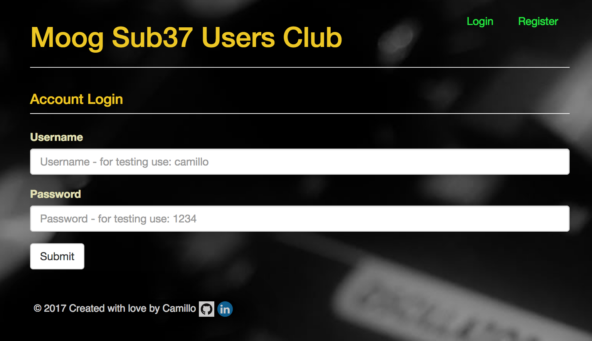

# Moog Sub37 Users Club

## UP & RUNNING
* `npm install`
- go to Mongo folder -> bin and start mongo server with "./mongod"
* `npm start`
* visit `http://localhost:3000/`
* For Testing `npm test`

### For Mongo Database details in 'mongo shell'
Mongo folder -> bin and start mongo server with "./mongod"
go to mongo -> bin, start shell with ./mongo
- >show dbs
- move to the database (ie. loginApp) >use loginapp
- show "tables" >show collections
- show "fields"(ie. registered users) >db.users.find()

### to deploy, used mlab:
- https://mlab.com/databases/loginapp#users

## Introduction
The idea to create a simple website using Frontend and Backend tools, was supported by my passion for synthesizer and sound creation.  Creating a patch, sharing and modulate it accordingly, require a great deal of dedication, lots of sound theory knowledge and being able to master the hardware. New synth editors allow to link hardware and software, using your special DAW, and test it with the best effects in the best setup.

## The Website
I wanted to create a really simple and clear website, easy to navigate and at the same time, with accessible features and information.

The **Account Registration** , connected with the Mongo database, allows users registration to be able to access the site.

  
  

The **Account Login** takes advantage of the stored users information to allow site access.

  
  

The **Home Page** is structured with a brief explanation/introduction of the goals related to the Moog Sub37 Users Club.

  
  

The **Info Page** shows the "Sub37" introduction over the specs and details; in addition, via the "Basics of Sound", the route brings us to a brief explanation of Subtractive Synthesis.

  
  

  
  

The **Feedback** place is a useful tool where the users can share their opinion and suggestions related to any topic.  Users can share information, patches, advice, fx/master... and just share how amazing is to use the Moog Sub37.

  
  

The **Chat** tool puts in immediate contact any website user, they can ask questions, start a thread (ie. over a modulation), share their achievements and much more.

  
  

## The Building of the site
As highlighted in the Introduction, Frontend and Backend tools have been used for the website.  The server file gets information from local API for the Events and the Feedback.  * [node.js] - (evented I/O for the backend) is the main engine. The Static files organized around HTML/CSS and Javascript are handled with modules like * [Express] - (fast node.js network app framework) and Handlebars (for the view ports).  While building the site, the Nodemon.js module was used to avoid manually restarting the server; for testing reasons Mocha/Chai libraries have been used.  Bottom line, the styling process was done using a simple and quick Bootstrap template.
For Database usage, linked to Mongo, I have used it for Authentication Registration and Login.

# What is being used

- [node](https://nodejs.org/en/)
- [express](https://expressjs.com/)
- [socketIO](https://socket.io/)
- [nodemon](https://nodemon.io/)
- [mongo](https://www.mongodb.com/)
- [mocha](https://mochajs.org/)
- [chaijs](http://chaijs.com/)
